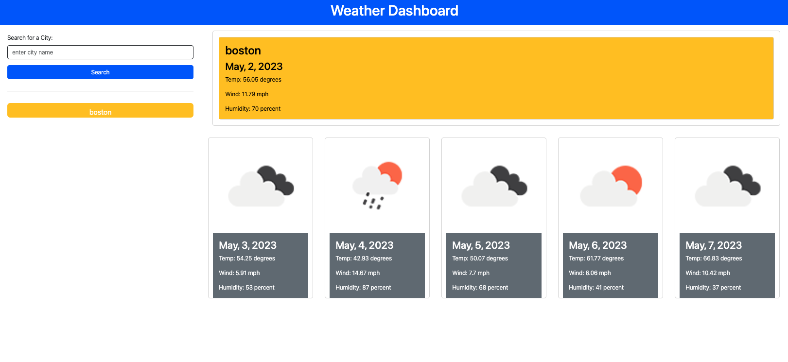

# Weather Dashboard -- Challenge 6

## The goal of the project was to create a fully functional weather dashboard using the Open Weather API, present the current weather corresponding to the input city, along with a five day forecast. The current day and forecast include the temperature, wind speed and humidity, along with a corresponding weather icon.
____

### Website Links
Deployed Site: https://vincer66.github.io/weather06/
Repository: https://github.com/VinceR66/weather06
____

### ScreenShot:
